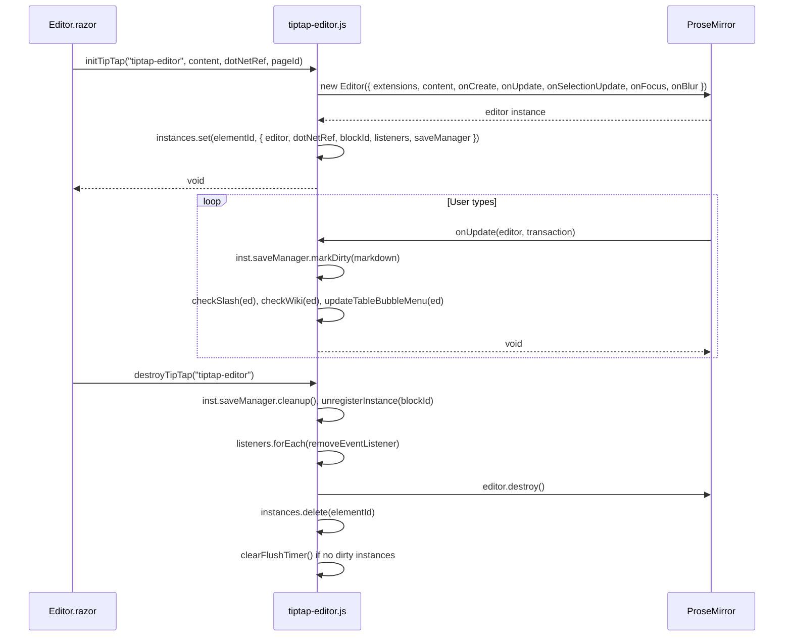
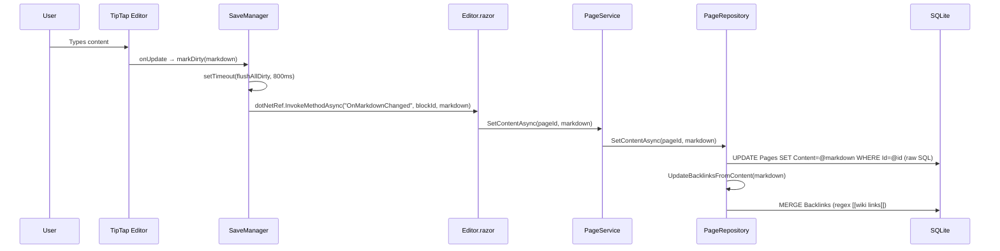
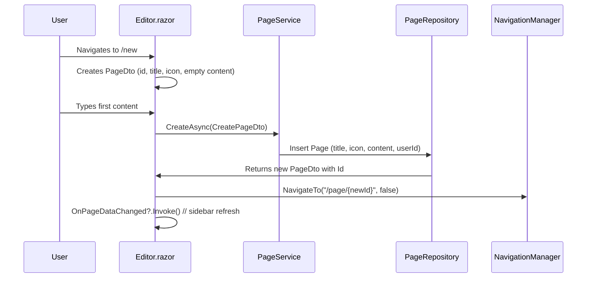
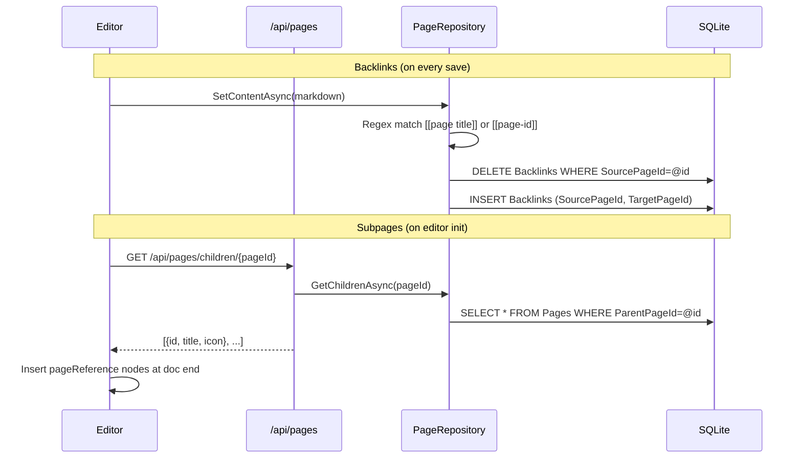

# Yanoch Developer Guide

Quick-start reference for contributors. Architecture, conventions, common tasks, and file map.

---

## Quick Start

```bash
# First time / after pulling
npm install
npx vite build
dotnet run --project src/Yanoch.Web

# Or one-liner
./run.sh
```

- App runs at **http://localhost:5072**
- Frontend bundle: `src/Yanoch.Web/wwwroot/js/tiptap-editor.js` (committed, rebuilt via Vite)
- DB: SQLite at `src/Yanoch.Web/yanoch.db` (auto-migrated on startup)

---

## Architecture

```
src/
├── Yanoch.Web/           # Blazor Server (UI, controllers, DI, JS interop)
├── Yanoch.Application/   # Services, DTOs, interfaces (use cases)
├── Yanoch.Domain/        # Entities, value objects, repository interfaces
└── Yanoch.Infrastructure/# EF Core, repositories, file storage, migrations
tests/
└── Yanoch.Tests/         # xUnit + Moq (Domain + Application layers)
```

**Dependency rule:** Web → Application → Domain ← Infrastructure
- Web references Application + Infrastructure (DI wiring only)
- Application references Domain only
- Domain has zero external dependencies
- Infrastructure implements Domain interfaces

### Module Dependency Graph (TipTap Editor)

```mermaid
graph TD
    A[tiptap-editor.src.js] --> B[tiptap-editor.js]
    B --> C[tiptap-slash-menu.js]
    B --> D[tiptap-wiki-autocomplete.js]
    B --> E[tiptap-callout-menus.js]
    B --> F[tiptap-table-menu.js]
    B --> G[tiptap-extensions.js]
    B --> H[tiptap-save-manager.js]
    B --> I[tiptap-image-upload.js]
    
    C --> J[@tiptap/suggestion]
    D --> J
    G --> K[@tiptap/core]
    G --> L[@tiptap/starter-kit]
    G --> M[@tiptap/extension-*]
    H --> N[native Map/Set]
    I --> O[native fetch]
```

---

## Tech Stack

| Layer | Library | Version | Rationale |
|-------|---------|---------|-----------|
| **Editor Core** | @tiptap/core | 3.29 | Headless ProseMirror wrapper |
| **Extensions** | @tiptap/starter-kit, extension-* | 3.29 | Batteries-included: tables, tasks, links, images |
| **Markdown** | @tiptap/markdown | 3.29 | Bidirectional Markdown ↔ ProseMirror |
| **Build** | Vite | 8.1.5 | Fast ES module bundler, single output |
| **Runtime** | .NET 10 / Blazor Server | 10.0 | Server-side rendering, SignalR circuit |
| **ORM** | EF Core | 9.x | SQLite, migrations, raw SQL for content |
| **Auth** | ASP.NET Core Identity | 9.x | Cookie-based, CascadingAuthenticationState |
| **Testing** | xUnit + Moq | Latest | Domain + Application layer coverage |

---

## TipTap Editor Deep-Dive

### Editor Lifecycle



### Blazor ↔ JS Interop Contract

**Window Functions (JS → called from Blazor):**

| JS Function | Blazor Caller | Params | Returns | Notes |
|-------------|---------------|--------|---------|-------|
| `initTipTap(elementId, content, dotNetRef, blockId)` | `Editor.razor:InitEditor()` | string, string, DotNetObjectRef, string | void | Creates editor instance in `instances` Map |
| `destroyTipTap(elementId)` | `Editor.razor:DestroyEditor()` | string | void | Cleans up listeners, destroys editor, nulls ref |
| `getTipTapMarkdown(elementId)` | (unused) | string | string | `editor.getMarkdown()` |
| `setTipTapContent(elementId, content)` | (unused) | string, string | void | `editor.commands.setContent()` |
| `setTipTapEditable(elementId, editable)` | (unused) | string, boolean | void | `editor.setEditable()` |
| `focusTipTap(elementId)` | (unused) | string | void | `editor.commands.focus()` |
| `blurTipTap(elementId)` | (unused) | string | void | `editor.commands.blur()` |

**Callbacks (JS → Blazor on `dotNetRef`):**

| JS Invokes | Blazor Method | Params |
|------------|---------------|--------|
| `OnMarkdownChanged` | `Editor.OnMarkdownChanged` | `string blockId, string markdown` |
| `OnFocus` | `Editor.OnFocus` | `string blockId` |
| `OnBlur` | `Editor.OnBlur` | `string blockId` |

**Instance Registry (JS side):**
```js
Map<string, { 
  editor, 
  dotNetRef, 
  blockId, 
  listeners: Array<{type, handler}>, 
  saveManager: { markDirty, cleanup },
  _dirty: boolean,
  _pendingMarkdown: string,
  firstUpdate: boolean,
  tableMenuEl: HTMLElement
}>
```
Keyed by `elementId` (e.g., `"tiptap-editor"`).

### Module Map

| Module | Exports | Responsibility |
|--------|---------|----------------|
| `tiptap-slash-menu.js` | `setupSlashMenu`, `getSlashState`, `closeSlash`, `renderSlash`, `runSlashItem`, `slashNavNext`, `slashNavPrev`, `checkSlash` | `/` command palette |
| `tiptap-wiki-autocomplete.js` | `setupWikiAutocomplete`, `getWikiState`, `closeWiki`, `renderWiki`, `runWikiItem`, `wikiNavNext`, `wikiNavPrev`, `checkWiki` | `[[` page linking |
| `tiptap-callout-menus.js` | `initCalloutMenus`, `getState`, `closeCalloutMenu` | Callout type/color picker |
| `tiptap-table-menu.js` | `closeTableBubbleMenu`, `updateTableBubbleMenu` | Table column/row ops |
| `tiptap-extensions.js` | `Callout`, `Toggle`, `PageReference`, `findEditorForElement` | Custom ProseMirror nodes |
| `tiptap-save-manager.js` | `registerInstance`, `unregisterInstance`, `setupSaveManager`, `forceFlushAll`, `clearFlushTimer`, `forceFlush`, `scheduleFlush` | Debounced auto-save (800ms) |
| `tiptap-image-upload.js` | `uploadImage`, `ensureImageInput`, `triggerImageUpload` | Image upload to `/api/upload` |

---

## Data Flows

### 1. Editor → DB (Auto-save)



**Key detail:** `PageRepository.SetContentAsync` uses raw SQL to bypass EF change tracker (avoids conflicts with concurrent reads).

### 2. Page Creation (First Content Save)



### 3. Backlinks & Subpages



---

## Recurring for New Features

### Add a New Editor Block (TipTap Node)

1. **Create node** in `tiptap-extensions.js` (extend `Node.create({...})`)
   - Add `parseHTML`, `renderHTML`, `addAttributes`, `addCommands`
   - Add Markdown spec via `createBlockMarkdownSpec({...})` for round-trip
2. **Add to editor extensions** in `createEditor()` → `extensions: [...]`
3. **Add slash menu item** in `slashItems[]` with `run: e => e.chain().focus().setYourNode().run()`
4. **Add wiki autocomplete** if node represents linkable content
5. **Rebuild:** `npx vite build`
6. **Test** in editor via `/` slash menu

### Add a New API Endpoint

1. **DTO** in `Application/DTOs/` (request/response)
2. **Interface** in `Application/Interfaces/I*Service.cs`
3. **Implementation** in `Application/Services/*Service.cs`
4. **Controller** in `Web/Controllers/Api/*Controller.cs` (`[ApiController]`, attribute routing)
5. Register service in `Web/Program.cs` (already scoped)

### Add a New Domain Entity

1. **Model** in `Domain/Models/*.cs` (props, navigation, `Guid` PK, `CreatedAt`/`UpdatedAt`)
2. **Interface** in `Domain/Interfaces/I*Repository.cs`
3. **Repository** in `Infrastructure/Data/Repositories/*Repository.cs`
4. **EF Config** in `AppDbContext.OnModelCreating` (or entity config class)
5. **Migration:** `dotnet ef migrations add Name -p src/Yanoch.Infrastructure -s src/Yanoch.Web`
6. **Service/DTO/Controller** as above

### Add a Callout Type

1. Edit `calloutTypes[]` in `tiptap-extensions.js` (Callout node `addAttributes`)
2. Add CSS variables in `app.css` under `.callout--{type}` selector
3. Rebuild: `npx vite build`

---

## Testing

```bash
# Run all tests
dotnet test tests/Yanoch.Tests

# With coverage
dotnet test tests/Yanoch.Tests --collect:"XPlat Code Coverage"
```

- **Project:** `tests/Yanoch.Tests/Yanoch.Tests.csproj`
- **Framework:** xUnit + Moq
- **Scope:** Domain models + Application services (no Web/Infrastructure)
- **Pattern:** `*Tests.cs` classes, `[Fact]` methods, `Assert.*` from xUnit
- **Mock repositories** via `Moq` — see `Domain/ModelTests.cs` for domain model tests

---

## File Reference Map

| Task | File |
|------|------|
| Editor config | `src/Yanoch.Web/wwwroot/js/tiptap-editor.src.js` |
| Editor styles | `src/Yanoch.Web/wwwroot/app.css` |
| Page CRUD API | `src/Yanoch.Web/Controllers/Api/PagesController.cs` |
| Page business logic | `src/Yanoch.Application/Services/PageService.cs` |
| Page DB access | `src/Yanoch.Infrastructure/Data/Repositories/PageRepository.cs` |
| Domain models | `src/Yanoch.Domain/Models/*.cs` |
| DI wiring | `src/Yanoch.Web/Program.cs`, `Application/DependencyInjection.cs`, `Infrastructure/DependencyInjection.cs` |
| DB context | `src/Yanoch.Infrastructure/Data/AppDbContext.cs` |
| Migrations | `src/Yanoch.Infrastructure/Migrations/*.cs` |
| Tests | `tests/Yanoch.Tests/Domain/ModelTests.cs` |
| Slash menu | `src/Yanoch.Web/wwwroot/js/tiptap/tiptap-slash-menu.js` |
| Wiki autocomplete | `src/Yanoch.Web/wwwroot/js/tiptap/tiptap-wiki-autocomplete.js` |
| Save manager | `src/Yanoch.Web/wwwroot/js/tiptap/tiptap-save-manager.js` |
| Custom extensions | `src/Yanoch.Web/wwwroot/js/tiptap/tiptap-extensions.js` |
| Editor component | `src/Yanoch.Web/Components/Pages/Editor.razor` |
| Main layout | `src/Yanoch.Web/Components/Layout/MainLayout.razor` |